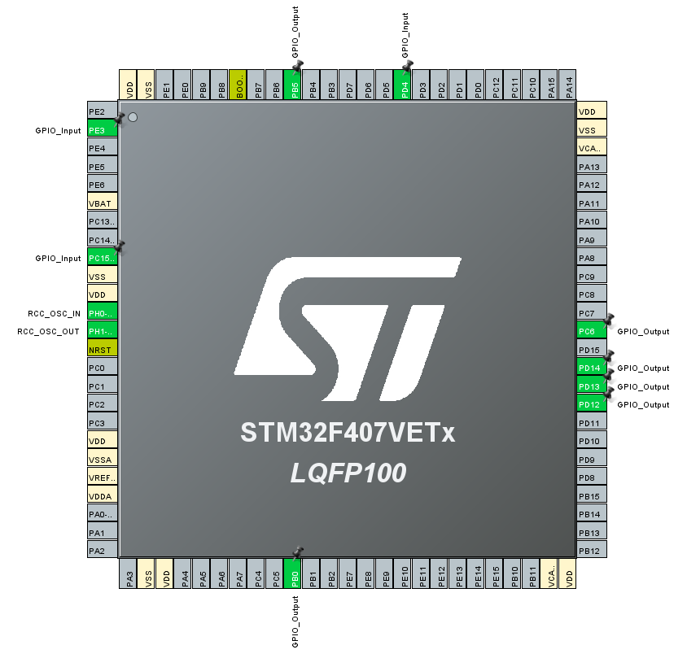

# [디지털 알람시계 프로그래밍 챌린지] 1-1. 버튼 입력으로 LED 토글 1

프로젝트마다 통으로 올리려고 했는데 생각보다 무거워서 이후에는 main.c와 .ioc 파일만 올리려고 합니다.

## 사용된 핀 설정

- LED1
    - (PORTD,12),(PORTD,13),(PORTD,14)
- LED2
    - (PORTC,6),(PORTB,5),(PORTB,0)
- Button
    - (PORTE,3),(PORTC,15),(PORTD,4),(PORTD,10)

## 설명
- 버튼에서 하강 엣지와 상승 엣지를 검출 할 필요가 있는데 이는 이전 상태를 기억하는 것으로 해결.
- LED또한 토글을 하기 위해서는 이전 상태를 기억할 필요가 있으므로 전용 변수를 만들어 조건문으로 분기.
- 포트와 핀을 구조체로 만들어 사용하는 방법을

## main 소스코드

자동생성 주석을 제거한 main.c 파일입니다.
```C

#include "main.h"
#include "gpio.h"

// 포트와 핀을 쉽게 관리하기 위한 구조체 선언
typedef struct {
    GPIO_TypeDef *port;
    uint16_t pin;
} GPIO_PinConfig;

// switch 상태를 읽어서 저장할 변수
GPIO_PinState switch_state[3];

// 마지막 스위치 상태를 저장하는 변수
GPIO_PinState last_switch_state[3] = {GPIO_PIN_RESET,GPIO_PIN_RESET,GPIO_PIN_RESET};

// LED 상태를 저장하는 변수
GPIO_PinState led_state[2][3] = {
		{GPIO_PIN_SET,GPIO_PIN_SET,GPIO_PIN_SET},
		{GPIO_PIN_SET,GPIO_PIN_SET,GPIO_PIN_SET}
};

// 스위치 및 LED 핀 설정 배열
GPIO_PinConfig switches[3] = {
    {GPIOE, GPIO_PIN_3},
    {GPIOC, GPIO_PIN_15},
    {GPIOD, GPIO_PIN_4}
};
GPIO_PinConfig leds[2][3] = {
    {{GPIOD, GPIO_PIN_12}, {GPIOD, GPIO_PIN_13}, {GPIOD, GPIO_PIN_14}},
    {{GPIOC, GPIO_PIN_6}, {GPIOB, GPIO_PIN_5}, {GPIOB, GPIO_PIN_0}}
};

void SystemClock_Config(void);

int main(void)
{
  HAL_Init();
  SystemClock_Config();
  MX_GPIO_Init();

  //초기 LED를 모두 OFF
  for (int i = 0; i < 2; i++)
  {
	  for (int j = 0; j < 3; j++)
	  {
		  HAL_GPIO_WritePin(leds[i][j].port, leds[i][j].pin, GPIO_PIN_SET);
	  }
  }

  while (1)
  {
      // 스위치 상태 읽기
      for (int i = 0; i < 3; ++i) {
          switch_state[i] = HAL_GPIO_ReadPin(switches[i].port, switches[i].pin);
      }

      // 스위치 상태에 따라 LED 토글
      for (int i = 0; i < 3; ++i) {
          if (switch_state[i] != last_switch_state[i]) {
              if (last_switch_state[i] == GPIO_PIN_RESET && switch_state[i] == GPIO_PIN_SET) {
                  // PUSH 상태
                  if (led_state[0][i] == GPIO_PIN_SET) {
                      HAL_GPIO_WritePin(leds[0][i].port, leds[0][i].pin, GPIO_PIN_RESET);
                      led_state[0][i] = GPIO_PIN_RESET;
                  } else {
                      HAL_GPIO_WritePin(leds[0][i].port, leds[0][i].pin, GPIO_PIN_SET);
                      led_state[0][i] = GPIO_PIN_SET;
                  }
              } else if (last_switch_state[i] == GPIO_PIN_SET && switch_state[i] == GPIO_PIN_RESET) {
                  // PULL 상태
                  if (led_state[1][i] == GPIO_PIN_SET) {
                      HAL_GPIO_WritePin(leds[1][i].port, leds[1][i].pin, GPIO_PIN_RESET);
                      led_state[1][i] = GPIO_PIN_RESET;
                  } else {
                      HAL_GPIO_WritePin(leds[1][i].port, leds[1][i].pin, GPIO_PIN_SET);
                      led_state[1][i] = GPIO_PIN_SET;
                  }
              }
          }

          last_switch_state[i] = switch_state[i]; // 스위치 상태 업데이트
      }
  }
}

```