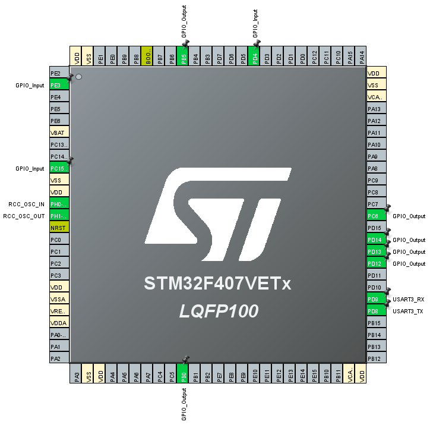

# [디지털 알람시계 프로그래밍 챌린지] 1-2. 버튼 입력 및 UART 입력으로 LED 토글

## 목표
- 4개의 버튼과 UART 통신을 사용하여 LED를 ON/OFF 컨트롤

## 사용된 핀 설정

- LED1
    - (PORTD,12),(PORTD,13),(PORTD,14)
- LED2
    - (PORTC,6),(PORTB,5),(PORTB,0)
- Button
    - (PORTE,3),(PORTC,15),(PORTD,4),(PORTD,10)
- UART3
    - RX: (PORTD,9)
    - TX: (PORTD,8)
    - buadRate: 115200 bps

## 설명

여러 기능을 추가하다 보니 코드가 상당히 난잡해 졌습니다.  구조체를 어느정도 어떻게 사용해야 할지 감이 잘 없네요.  
일단 이전의 코드에서 추가한다는 생각을 가지고 만들어 보았습니다.  
PUSH만 사용하지만 이 후에 PULL 기능을 사용할 가능성이 높아 기능만 남겨 두었습니다.  

만들었을 때는 문제가 없을 줄 알았는데 막상 코드를 올려보니 문제가 생기더군요.

### troubleshooting
- 버튼을 눌러도 정상적인 동작을 하지 않음
    - 원인: 선언하지 않은 배열을 사용하는 실수를 함.  

- UART로 수신한 문자가 정상적으로 수신되지 않음
    - 원인: 작동 속도를 9600으로 하였었는데 원인을 찾지 못하다가 115200으로 수정하니 정상작동.  
    클럭속도가 너무 빨라 샘플링에 문제가 생긴것으로 추정하고 있으나 정확한건 모름.
- 입력데이터의 제한을 두지 않았을때 LED가 순간 켜졌다가 다시 꺼짐(미해결)
    - 원인: 정확하게 잘 모르겠음.  
아두이노의 시리얼 터미널을 사용했는데 NULL이나 개행문자도 같이 전송해서 문제가 되는 것인가 추측만 하고 있음.

## 작동 영상
영상링크  
[](https://youtu.be/8h-vduq7o7I?si=8aRZ8jr8vYB7ul-a)

## main 소스코드

자동생성 주석을 제거한 main.c 파일입니다.
```C

#include "main.h"
#include "usart.h"
#include "gpio.h"

// 포트와 핀을 쉽게 관리하기 위한 구조체 선언
typedef struct {
    GPIO_TypeDef *port;
    uint16_t pin;
} GPIO_PinConfig;

// LED 선택을 하기 위한 전용 타입
typedef enum {
	LEFT_LED,
	RIGHT_LED
}SelectLED;

// switch 상태를 읽어서 저장할 변수
GPIO_PinState Button_state[4];

// 마지막 스위치 상태를 저장하는 변수
GPIO_PinState last_Button_state[4] = {GPIO_PIN_RESET,GPIO_PIN_RESET,GPIO_PIN_RESET,GPIO_PIN_RESET};

// LED 상태를 저장하는 변수
GPIO_PinState led_state[2][3] = {
		{GPIO_PIN_SET,GPIO_PIN_SET,GPIO_PIN_SET},
		{GPIO_PIN_SET,GPIO_PIN_SET,GPIO_PIN_SET}
};

// 버튼 및 LED 핀 설정 배열
GPIO_PinConfig Buttones[4] = {
    {GPIOE, GPIO_PIN_3},
    {GPIOC, GPIO_PIN_15},
    {GPIOD, GPIO_PIN_4},
	{GPIOD, GPIO_PIN_10}
};

GPIO_PinConfig leds[2][3] = {
    {{GPIOD, GPIO_PIN_12}, {GPIOD, GPIO_PIN_13}, {GPIOD, GPIO_PIN_14}},
    {{GPIOC, GPIO_PIN_6}, {GPIOB, GPIO_PIN_5}, {GPIOB, GPIO_PIN_0}}
};

// 초기에는 왼쪽 LED를 선택
SelectLED SelectedLED = LEFT_LED;

// UART를 사용하기 위한 변수
uint8_t uart3_rx_data;
uint8_t uart3_rx_flag;

void SystemClock_Config(void);
static void MX_NVIC_Init(void);

int main(void)
{

  HAL_Init();
  SystemClock_Config();
  MX_GPIO_Init();
  MX_USART3_UART_Init();

  MX_NVIC_Init();

  HAL_UART_Receive_IT(&huart3, &uart3_rx_data, sizeof(uart3_rx_data));

  //초기 LED를 모두 OFF
  for (uint8_t i = 0; i < 2; i++)
  {
	  for (uint8_t j = 0; j < 3; j++)
	  {
		  HAL_GPIO_WritePin(leds[i][j].port, leds[i][j].pin, GPIO_PIN_SET);
	  }
  }

  uint8_t led_rx_data;

  while (1)
  {

    // 스위치 상태 읽기
    for (uint8_t i = 0; i < 4; ++i) {
        Button_state[i] = HAL_GPIO_ReadPin(Buttones[i].port, Buttones[i].pin);
    }

    // LED 선택 스위치 확인
    if (Button_state[3] != last_Button_state[3]) {
      if (last_Button_state[3] == GPIO_PIN_RESET && Button_state[3] == GPIO_PIN_SET){
      if (SelectedLED == LEFT_LED) SelectedLED = RIGHT_LED;
      else SelectedLED = LEFT_LED;
    }
    }

    last_Button_state[3] = Button_state[3];

    // 스위치 상태에 따라 LED 토글
    for (uint8_t i = 0; i < 3; ++i) {
        if (Button_state[i] != last_Button_state[i]) {
            if (last_Button_state[i] == GPIO_PIN_RESET && Button_state[i] == GPIO_PIN_SET) {
                // PUSH
                if (led_state[SelectedLED][i] == GPIO_PIN_SET) {
                    HAL_GPIO_WritePin(leds[SelectedLED][i].port, leds[SelectedLED][i].pin, GPIO_PIN_RESET);
                    led_state[SelectedLED][i] = GPIO_PIN_RESET;
                } else {
                    HAL_GPIO_WritePin(leds[SelectedLED][i].port, leds[SelectedLED][i].pin, GPIO_PIN_SET);
                    led_state[SelectedLED][i] = GPIO_PIN_SET;
                }
            } else if (last_Button_state[i] == GPIO_PIN_SET && Button_state[i] == GPIO_PIN_RESET) {
                // PULL, 여기서는 구현만 되어 있고 아무 작동하지 않음
            }
        }
        last_Button_state[i] = Button_state[i]; // 스위치 상태 업데이트
    }

    // 시리얼로 데이터 수신시 uart3_rx_flag 를 1로 만들어 작동
    if(uart3_rx_flag){
      led_rx_data = (uart3_rx_data -'1');

      if(led_rx_data>=0 && led_rx_data<=2) {
      if (led_state[SelectedLED][led_rx_data] == GPIO_PIN_SET) {
        HAL_GPIO_WritePin(leds[SelectedLED][led_rx_data].port, leds[SelectedLED][led_rx_data].pin, GPIO_PIN_RESET);
        led_state[SelectedLED][led_rx_data] = GPIO_PIN_RESET;
      } else {
        HAL_GPIO_WritePin(leds[SelectedLED][led_rx_data].port, leds[SelectedLED][led_rx_data].pin, GPIO_PIN_SET);
        led_state[SelectedLED][led_rx_data] = GPIO_PIN_SET;
      }
      }else if (led_rx_data == 3) {
      if (SelectedLED == LEFT_LED) SelectedLED = RIGHT_LED;
      else SelectedLED = LEFT_LED;
      }

    uart3_rx_flag = 0;
    }
  }
}

void SystemClock_Config(void)
{
  RCC_OscInitTypeDef RCC_OscInitStruct = {0};
  RCC_ClkInitTypeDef RCC_ClkInitStruct = {0};

  __HAL_RCC_PWR_CLK_ENABLE();
  __HAL_PWR_VOLTAGESCALING_CONFIG(PWR_REGULATOR_VOLTAGE_SCALE1);

  RCC_OscInitStruct.OscillatorType = RCC_OSCILLATORTYPE_HSI;
  RCC_OscInitStruct.HSIState = RCC_HSI_ON;
  RCC_OscInitStruct.HSICalibrationValue = RCC_HSICALIBRATION_DEFAULT;
  RCC_OscInitStruct.PLL.PLLState = RCC_PLL_ON;
  RCC_OscInitStruct.PLL.PLLSource = RCC_PLLSOURCE_HSI;
  RCC_OscInitStruct.PLL.PLLM = 8;
  RCC_OscInitStruct.PLL.PLLN = 168;
  RCC_OscInitStruct.PLL.PLLP = RCC_PLLP_DIV2;
  RCC_OscInitStruct.PLL.PLLQ = 4;
  if (HAL_RCC_OscConfig(&RCC_OscInitStruct) != HAL_OK)
  {
    Error_Handler();
  }

  RCC_ClkInitStruct.ClockType = RCC_CLOCKTYPE_HCLK|RCC_CLOCKTYPE_SYSCLK
                              |RCC_CLOCKTYPE_PCLK1|RCC_CLOCKTYPE_PCLK2;
  RCC_ClkInitStruct.SYSCLKSource = RCC_SYSCLKSOURCE_PLLCLK;
  RCC_ClkInitStruct.AHBCLKDivider = RCC_SYSCLK_DIV1;
  RCC_ClkInitStruct.APB1CLKDivider = RCC_HCLK_DIV4;
  RCC_ClkInitStruct.APB2CLKDivider = RCC_HCLK_DIV2;

  if (HAL_RCC_ClockConfig(&RCC_ClkInitStruct, FLASH_LATENCY_5) != HAL_OK)
  {
    Error_Handler();
  }
}

static void MX_NVIC_Init(void)
{
  HAL_NVIC_SetPriority(USART3_IRQn, 0, 0);
  HAL_NVIC_EnableIRQ(USART3_IRQn);
}


void HAL_UART_RxCpltCallback(UART_HandleTypeDef *huart)
{
	if(huart->Instance == USART3) {
		HAL_UART_Receive_IT(&huart3, &uart3_rx_data, sizeof(uart3_rx_data));
		uart3_rx_flag = 1;
	}
}

void Error_Handler(void)
{
  __disable_irq();
  while (1)
  {
  }

}

```
